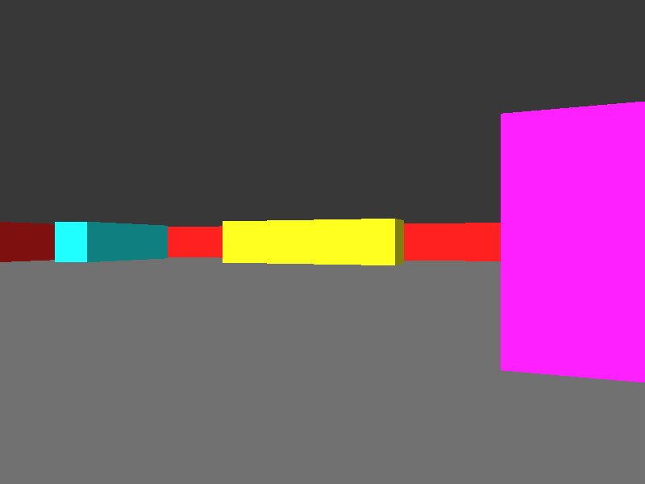

# Raycasting
A raycasting engine based on the one used in a 1992 game **Wolfenstein 3D**.

## Checklist
- [x] view rotation
- [x] view translation
- [ ] collision detection
- [x] solid color raycaster
- [ ] texture-mapped raycaster

## Dependencies
- [SDL](https://github.com/libsdl-org/SDL/releases/latest)

## Building
- Run the Makefile included in the project using `$ make`.
- The executable, once built, can be found in `./out/`.

## References
- [Lode's Tutorial on Raycasting](https://lodev.org/cgtutor/raycasting.html)